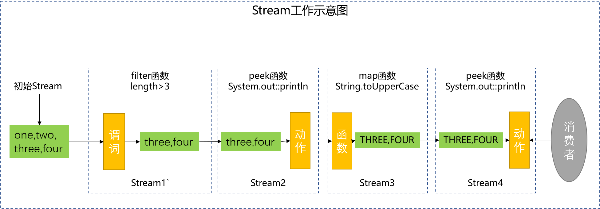

## 为什么要写本文

在之前的一篇文章[Java 8 Streams peek API](https://www.jianshu.com/p/3e1501fd33a9)中我们介绍了一些使用Java Stream peek函数的样例，读者对`peek 函数的使用提出很多建设性的建议，作者受益良多。与此同时也有小伙伴对peek和map两个函数之间的差异感到困惑，尤其涉及修改Stream中的元素时。考虑到之前的文章没有详细的解释清楚两个函数之间的区别，故此通过本文尝试做出一些有利于大家学习使用两个函数的解释，如有不足之处，恳请及时反馈，共同学习共同进步。

## peek和map的异同之处

* 两个函数都是中间操作，都非常的‘懒’，没有对Stream的终止操作，两个函数都不会工作。
* peek函数的存在仅仅是为了debug，而map是Stream的一个核心函数，两个函数的地位不同。
* 两个函数的返回值都是一个新的Stream，但是两个函数的参数（peek是Consumer，map是Function）起作用的时机不同。map的Function在生成新的Stream之前被执行，新Stream中的元素是上游Stream中元素经Function作用后的值。peek函数的Consumer工作在生成Stream之后，下一节详细讲解两个函数执行时机。

## 一个有代表性的样例

以下面一段函数（来自peek函数的官方注释）为例解释peek和map两个函数工作机制的不同：

~~~java
List<String> list = Stream.of("one", "two", "three", "four")
		.filter(e -> e.length() > 3)
		.peek(e -> System.out.println("Filtered value: " + e))
		.map(String::toUpperCase)
		.peek(e -> System.out.println("Mapped value: " + e))
		.collect(Collectors.toList());
System.out.println(list);
~~~

**输出如下：**

~~~
Filtered value: three
Mapped value: THREE
Filtered value: four
Mapped value: FOUR
[THREE, FOUR]
~~~

**工作示意图如下：**

**工作流程概述：**

1、初始Stream包含四个字符串:one，two，three和four

2、Stream遇到的第一个中间操作是filter，filter的谓词是只保留长度大于3的字符串，经过谓词过滤后filter返回是一个仅包含两个字符串three和four的Stream1，谓词工作在Stream1生成之前。

3、Stream遇到的第二个中间操作是peek，peek的Consumer是打印Stream中的字符串，peek直接生成一个和上游Stream1包含相同元素的Stream2，peek函数的Consumer工作在生成Stream2之后。

4、Stream遇到的第三个中间操作是map，map的Function将字符串转换为全大写，Function作用于上游Stream2的每一个元素，并生成新的Stream3。

5、Stream遇到的第四个中间操作是peek，peek的Consumer依然只是打印Stream4中的字符串，Consumer依然工作在Stream4生成之后。

## peek和map修改Stream的元素

map函数对Stream中元素执行的是映射操作，会以新的元素(map的结果)填充新的Stream，严格的讲map不是修改原来的元素。peek只能消费Stream中的元素，是否可以更该Stream中的元素，取决于Stream中的元素是否是不可变对象。如果是不可变对象，则不可修改Stream中的元素；如果是可变对象，则可以修改对象的值，但是无法修改对象的引用。

* 不可变对象场景：

适当的修改上面的样例：

~~~java
List<String> list = Stream.of("one", "two", "three", "four")
		.filter(e -> e.length() > 3)
		.peek(s -> {
			s = s + "-" + s;
			System.out.println(s);
		})
		.map(String::toUpperCase)
		.peek(e -> System.out.println("Mapped value: " + e))
		.collect(Collectors.toList());
System.out.println(list);
~~~

**输出如下：**

~~~
three-three
Mapped value: THREE
four-four
Mapped value: FOUR
[THREE, FOUR]
~~~

由输出结果可知peek并没有修改Stream的元素，list的值依然是：[THREE, FOUR]

* 可变对象

定义一个简单的Java对象`Company`：

~~~java
class Company {
    private String name;
    private int age;
    // 省略构造函数，getter/setter和toString方法
}
~~~

样例代码：

~~~java
Company apple = new Company("apple", 44);
Company huawei = new Company("huawei", 33);
Company qualcomm = new Company("Qualcomm ", 35);
List<Company> list = Stream.of(apple, huawei, qualcomm)
		.filter(company -> company.getAge() < 35)
		.peek(company -> company.setAge(company.getAge() - 10))
		.map(company -> new Company(company.getName().toUpperCase(),company.getAge()))
		.peek(e -> System.out.println("Mapped value: " + e))
		.collect(Collectors.toList());
System.out.println(list);
~~~

上面的代码输出的结果是什么？不妨花费几分钟的时间思考以下。

🤔🤔🤔🤔🤔🤔🤔🤔🤔🤔🤔🤔🤔🤔🤔🤔🤔🤔🤔🤔

**输出的结果如下：**

~~~java
Mapped value: Person{name='HUAWEI', age=23}
[Person{name='HUAWEI', age=23}]
~~~

你计算的结果和预期一致吗？

对于peek和map函数你理解了吗，如果我还是没有讲清楚，欢迎留言交流。