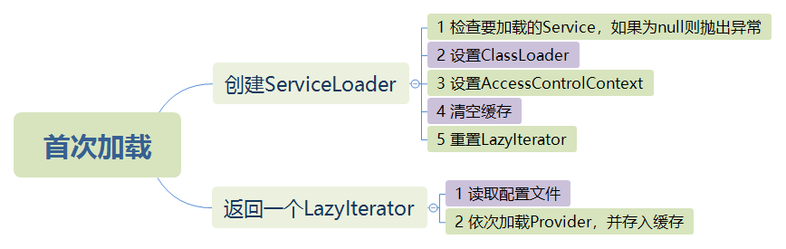
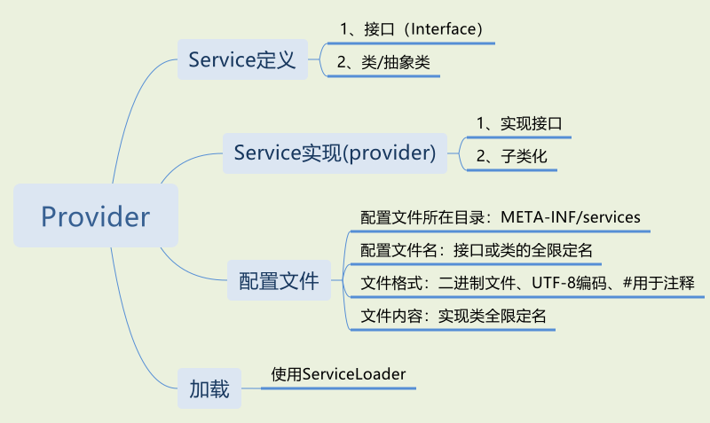

# Service Provider Interface(SPI)

## 什么是Service？

Service是一组知名的接口和类（类通常都是抽象类），Service Provider是Service的一种特定实现。Service Provider中的类实现了Service中定义的接口或者是Service中定义的类的子类。Java平台可以以扩展的方式安装Service Provider，也就是说可以将Service Provider的jar放置在任何常用的扩展目录之中。Service Provider可以通过放置在应用的class path或以其他平台支持的方式提供服务。

## ServiceLoader

ServiceLoader是Java提供的一个用于加载Service Provider的简单工具。出于加载的目的，Service必须由单一类型表示，即单一接口或抽象类也可以使用具体类但是不建议。特定的Service Provider包含一个或多个具体类，这些类用特定于Provider的数据和代码扩展此Service。Provider类通常不是整个Provider本身，而是包含足够信息以决定提供者是否能够满足特定请求以及可以按需创建实际Provider的代理。Provider类和特定的Service高度相关，不可能由单个类或接口统一定义，因此Java规范也并未就此定义。ServiceLoader对于Provider的唯一要求就是Provider有默认的构造函数已确保在加载Provider过程中创建Provider实例。

**Service Provider配置** 

`META-INF/services` 中的配置文件用于唯一标识一个ServiceProvider。配置文件的名字是定义Service的接口或类的全限定名。文件内容为具体的ServicePorvider实现类全限定名，每行一个定义。文件使用#号注释，而且必须使用UTF-8编码。

如果一个具体的Service Provider类包含在多个配置文件中，或者一个配置文件中包含多个Service Provider，重复的将会被忽略。配置文件中配置的Service Provider无需和配置文件在同一个jar或其他分发单元之中。Service Provider必须可以使用加载配置文件的class loader访问，其中class loader不一定是实际加载配置文件的class loader。

**ServiceLoader 的加载机制** 

两个词描述ServiceLoader的加载机制就是：缓存和懒加载。

ServiceLoader缓存已经加载的Provider，并可以通过`reload()` 方法清空缓存。ServiceLoader懒加载Provider，只有当需要Provider时比如方法调用才真正的加载实例化Provider。

下面是ServiceLoader首次加载的流程示意图：

**安全性**

service loader一直在调用者的安全上下文中执行。可信系统代码通常应从特权安全上下文中调用此类中的方法以及它们返回的迭代器的方法。

**线程安全** 

ServiceLoader是非线程安全的。

> 无特殊说明传递给ServiceLoader的任何参数为null，ServiceLoader都会抛出`NullPointerException` 异常。

## 3 Service Provider样例

开发一个Service Provider需要上面的四个步骤：1、首先定义Service或实现其他Service；2、实现Service定义的功能；3、配置以让ServiceLoader可以加载Service实现；4、加载Service Provider使用。下面以一个获取主机地址列表为例一步一步讲解如何实现：

### 3.1 定义服务

定义一个只有获取地址列表的服务**IHostProvider** 

~~~java
public interface IHostProvider {
    /**
     * 获取主机地址列表
     * @return
     */
    List<String> hosts();
}
~~~

### 3.2 实现**IHostProvider** 服务

为了区分不同的Provider，分别实现获取本地地址列表和远程地址列表两个Provider

**Local Host Provider：** 

~~~java
package io.github.ctlove0523.spi.local;

import io.github.ctlove0523.spi.api.IHostProvider;

import java.util.Collections;
import java.util.List;

public class LocalHostProvider implements IHostProvider {
    public LocalHostProvider() {
        System.out.println("local host provider loaded");
    }

    @Override
    public List<String> hosts() {
        return Collections.singletonList("localhost");
    }
}
~~~

**Remote Host Provider：** 

~~~java
package iot.github.ctlove0523.spi.remote;

import io.github.ctlove0523.spi.api.IHostProvider;

import java.util.Collections;
import java.util.List;

public class RemoteHostProvider implements IHostProvider {
    public RemoteHostProvider() {
        System.out.println("remote host provider loaded");
    }

    @Override
    public List<String> hosts() {
        return Collections.singletonList("10.23.45.67");
    }

}
~~~

### 3.3 增加配置文件

**Local Host Provider** 增加如下配置文件：

~~~
resources/META-INF/services/io.github.ctlove0523.spi.api.IHostProvider
~~~

文件的内容为：

~~~
io.github.ctlove0523.spi.local.LocalHostProvider
~~~

**Remote Host Provider** 增加如下配置文件：

~~~
resources/META-INF/services/io.github.ctlove0523.spi.api.IHostProvider
~~~

文件的内容为：

~~~
iot.github.ctlove0523.spi.remote.RemoteHostProvider
~~~

### 3.4 加载Provider

引入**Local Host Provider** 和 **Remote Host Provider** 以及**IHostProvider** 三个Jar文件。下面第一段程序说明了ServiceLoader的懒加载机制：

~~~java
ServiceLoader<IHostProvider> hostProviders = ServiceLoader.load(IHostProvider.class);
        System.out.println(hostProviders.iterator().hasNext() ? "load success" : "load failed");
~~~

输出：

~~~
load success
~~~

并没有输出Provider默认构造函数的信息，说明ServiceLoader还没有真正的实例化Provider，这证明了上面提到的ServiceLoader懒加载机制。

第二段程序获取所有的IHostProvider的实现并调用方法：

~~~java
ServiceLoader<IHostProvider> hostProviders = ServiceLoader.load(IHostProvider.class);
hostProviders.iterator().forEachRemaining(new Consumer<IHostProvider>() {
	@Override
	public void accept(IHostProvider iHostProvider) {
		System.out.println(iHostProvider.hosts());
	}
});
~~~

输出：

~~~
local host provider loaded
[localhost]
remote host provider loaded
[10.23.45.67]
~~~

从输出来看ServiceLoader真正的实例化了每一个Provider。
