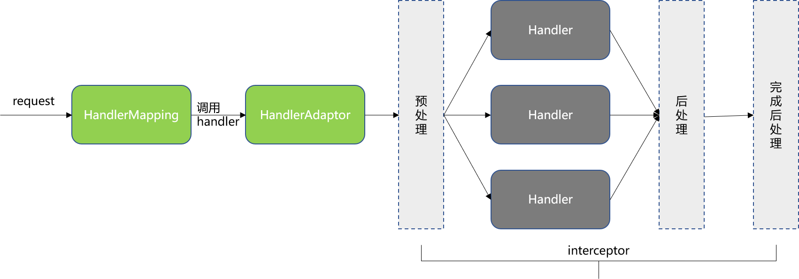
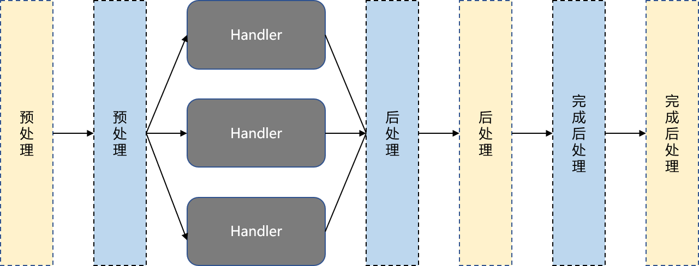
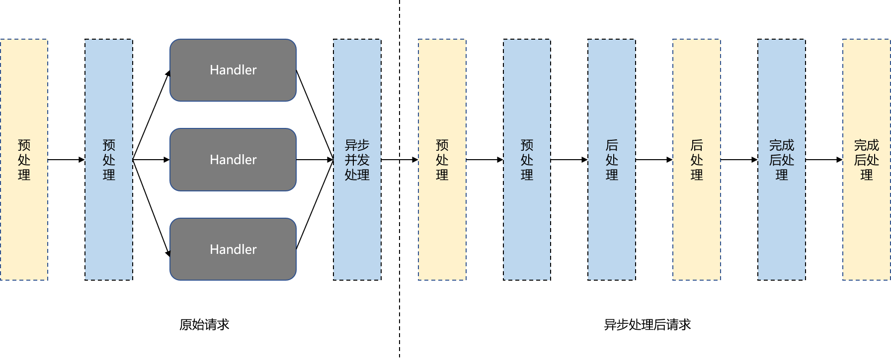

源代码可从[这里](https://github.com/ctlove0523/spring-samples/tree/master/interceptor)下载。

### 什么是HandlerInterceptor？

HandlerInterceptor是支持自定义handler执行链的工作流接口。应用程序可以为handler组注册任意数量的已有或自定义拦截器，以添加常见的预处理行为，而无需修改每个处理程序实现。通俗点讲就是支持在handler执行前后执行自定义逻辑。

### HandlerInterceptor能干什么

从HandlerInterceptor工作的机制来分析一下HandlerInterceptor可以完成哪些工作，对于哪些工作又无能为力。



HandlerInterceptor三个方法：preHandle、postHandle和afterCompletion的执行时间点如下：

**preHandle**：在HandlerMapping确定使用哪个Handler处理请求之后，HandlerAdapter调用Handler之前，在该阶段HandlerInterceptor可以修改Request和Response。

**postHandle**：在HandlerAdapter调用Handler之后，DispatcherServlet渲染视图之前。实际上在调用postHandler之前HandlerAdapter已经完成写Response并提交，因此postHandler无法修改Response。如果有修改Response的场景，可以使用ResponseBodyAdvice接口。

**afterCompletion**：请求处理完成之后调用，适合做一些资源清理工作。

使用HandlerInterceptor的基本原则：与业务相关的细粒度任务适合首选HandlerInterceptor。下面是一些可以选择使用HandlerInterceptor的场景：

* 鉴权，可以使用HandlerInterceptor但是Filter是更加的选择。
* 审计日志，记录每一个请求方便对操作审计。
* Token解析或校验。
* Handler执行时间统计等。

### 自定义HandlerInterceptor

自定义一个拦截器需要实现`org.springframework.web.servlet.HandlerInterceptor`接口，`HandlerInterceptor` 接口有三个方法可供具体实现覆写：

* preHandle(HttpServletRequest request, HttpServletResponse response, Object handler)
        throws Exception
* postHandle(HttpServletRequest request, HttpServletResponse response, Object handler,
  			@Nullable ModelAndView modelAndView) throws Exception 
* afterCompletion(HttpServletRequest request, HttpServletResponse response, Object handler,
  			@Nullable Exception ex) throws Exception

> 说明：上面的三个方法HandlerInterceptor接口已经提供默认实现，如果HandlerInterceptor的实现没有覆写方法，则该HandlerInterceptor不会做任何事情。

#### 第一个HandlerInterceptor

下面定义一个仅记录各方法调用时间的简单的HandlerInterceptor。

**HandlerInterceptor：** 

```java
@Slf4j
public class FirstHandlerInterceptor implements HandlerInterceptor {
    private String name;

    FirstHandlerInterceptor(String name) {
        this.name = name == null ? getClass().getName() : name;
    }

    @Override
    public boolean preHandle(HttpServletRequest request, HttpServletResponse response, Object handler) {
        log.info("enter {} interceptor pre handle method at {}", name, System.currentTimeMillis());
        return true;
    }

    @Override
    public void postHandle(HttpServletRequest request, HttpServletResponse response, Object handler,
                           @Nullable ModelAndView modelAndView) {
        log.info("enter {} interceptor post handle method at {}", name, System.currentTimeMillis());
    }

    @Override
    public void afterCompletion(HttpServletRequest request, HttpServletResponse response, Object handler,
                                @Nullable Exception ex) {
        log.info("enter {} interceptor after completion method at {}", name, System.currentTimeMillis());
    }
}
```

####  注册HandlerInterceptor

在Spring Boot中使用WebMvcConfigurer可以非常方便的注册HandlerInterceptor。下面是一个简单注册HandlerInterceptor的样例代码：

~~~java
@EnableWebMvc
@Configuration
public class InterceptorConfigure implements WebMvcConfigurer {

    @Override
    public void addInterceptors(InterceptorRegistry registry) {
        registry.addInterceptor(new FirstHandlerInterceptor("FIRST"));
    }
}
~~~

> 其中注解`@Configuration` 和 `@EnableWebMvc` 是必须的。

#### 测试HandlerInterceptor

启动Spring Boot并调用一个测试接口，测试接口可从[这里](https://github.com/ctlove0523/spring-samples/tree/master/interceptor)获取。

~~~shell
curl -i http://localhost:8080/user/login
~~~

应用的输出如下：

~~~
enter FIRST interceptor pre handle method at 1583651101064
enter FIRST interceptor post handle method at 1583651101068
enter FIRST interceptor after completion method at 1583651101068
~~~

从输出可以看出三个方法的调用顺序未：preHandle -> postHandle -> afterCompltion

#### HandlerInterceptor的执行顺序

和Filter不同，HandlerInterceptor没有一个对应的order属性可以用来标记HandlerInterceptor的执行顺序，HandlerInterceptor的执行顺序和注册HandlerInterceptor的顺序保持一致。修改上面InterceptorConfigure的代码以注册多个HandlerInterceptor：

~~~java
@EnableWebMvc
@Configuration
public class InterceptorConfigure implements WebMvcConfigurer {

    @Override
    public void addInterceptors(InterceptorRegistry registry) {
        registry.addInterceptor(new FirstHandlerInterceptor("FIRST"));
        registry.addInterceptor(new FirstHandlerInterceptor("SECOND"));
    }
}
~~~

启动Spring Boot并调用一个测试接口，测试接口可从[这里](https://github.com/ctlove0523/spring-samples/tree/master/filter)获取。

~~~shell
curl -i http://localhost:8080/user/login
~~~

应用的输出如下：

~~~
enter FIRST interceptor pre handle method at 1583651310410
enter SECOND interceptor pre handle method at 1583651310410
enter SECOND interceptor post handle method at 1583651310453
enter FIRST interceptor post handle method at 1583651310453
enter SECOND interceptor after completion method at 1583651310453
enter FIRST interceptor after completion method at 1583651310453
~~~

HandlerInterceptor的调用顺序未FIRST HandlerInterceptor - > SECOND HandlerInterceptor。多个HandlerInterceptor的方法执行示意图如下：



### 异步HandlerInterceptor

AsyncHandlerInterceptor是HandlerInterceptor的子接口，可在异步请求处理后调用。当Handler启动处理一个异步请求时，DispatcherServlet退出之前不会调用postHandle和afterCompletion两个方法（同步请求DispatcherServlet退出前会调用），因为可能尚未准备好请求处理的结果，并且有可能结果在另外一个线程中产生。在这种场景，DispatcherServlet将改为调用afterConcurrentHandlingStarted方法，以支持实现在释放线程之前清理与线程相关的资源等类似的任务。

异步处理完成后，请求将分发到容器以进行进一步处理。在此阶段，DispatcherServlet调用preHandle，postHandle和afterCompletion。拦截器可以通过检查`ServletRequest`的 `javax.servlet.DispatcherType`属性来区分请求是原始请求还是异步处理之后再次分发的请求，`"REQUEST"` 表示原始请求， `"ASYNC"`表示异步处理之后的请求。 

在异步请求超时或网络错误导致请求完成的场景，HandlerInterceptor的实现需要继续完成本来的工作。但是在这种情况下，Servlet容器不会分发请求，因此也不会调用postHandle和afterCompletion两个方法，相反可以使用WebAsyncManager的registerDeferredResultInterceptor和registerCallbackInterceptor方法注册拦截器以跟踪异步请求。

### 同步和异步拦截器样例

样例实现下面三个功能：

1、同步拦截器向HttpRequest添加属性：Service-Transition-Id

2、异步拦截器获取Service-Transition-Id属性并打印

3、实现异步Request，并验证拦截器的调用属性。

**AsyncHandlerInterceptor**：

```java
@Slf4j
public class SelfAsyncHandlerInterceptor implements AsyncHandlerInterceptor {
    private String name;

    SelfAsyncHandlerInterceptor(String name) {
        this.name = name;
    }

    @Override
    public void afterConcurrentHandlingStarted(HttpServletRequest request, HttpServletResponse response,
                                               Object handler) {
        log.info("enter {} interceptor", this.name);
        log.info("Service-Transition-Id = {}", request.getAttribute("Service-Transition-Id"));
    }
}
```

**Async Request** ：

```java
@GetMapping("/user/quotes")
@ResponseBody
public DeferredResult<String> quotes() {
    DeferredResult<String> deferredResult = new DeferredResult<String>();
    executor.execute(() -> deferredResult.setResult("Hello Async Request"));
    return deferredResult;
}
```

测试拦截器：

启动Spring Boot应用，调用异步接口：

~~~
curl -i http://localhost:8080/user/quotes
~~~

应用输出：

~~~
enter FIRST interceptor pre handle method at 1583658644588
enter async interceptor interceptor pre handle method at 1583658644589
enter quotes
enter async interceptor interceptor
Service-Transition-Id = 2317252d-dade-4ca1-848a-d9653848f8f0
enter FIRST interceptor pre handle method at 1583658644605
enter async interceptor interceptor pre handle method at 1583658644605
enter async interceptor interceptor post handle method at 1583658644621
enter FIRST interceptor post handle method at 1583658644621
enter async interceptor interceptor after completion method at 1583658644622
enter FIRST interceptor after completion method at 1583658644622
~~~

从应用输出可以归纳出异步拦截器和同步拦截器一起工作时（同步拦截器先注册）方法的执行顺序如下：



### 参考：

1、[Spring API](https://docs.spring.io/spring/docs/5.2.4.RELEASE/javadoc-api/)

2、[Spring Documentation](https://docs.spring.io/spring/docs/5.2.4.RELEASE/spring-framework-reference/web.html#spring-web)


