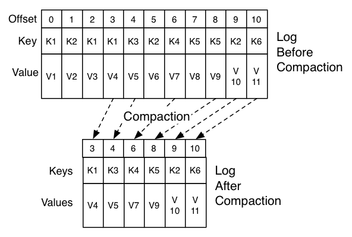

# 4 Kafka设计理念

## 4.1 设置动机

我们期望Kafka能够作为处理大公司可能拥有的所有实时数据反馈的统一平台。为实现这个目的，我们必须考虑相当广泛的使用场景。

* 必须具有高吞吐量以支持高容量事件流，例如实时日志聚合。
* 优雅的处理大型数据，以便能够支持离线系统定期的数据加载。
* 支持低延迟数据传输，以支持更加传统的消息使用场景。

我们希望支持这些源的分区，分布式，实时处理，以创建新的派生源，这激发了Kafka的分区和消费者模式。

最后，在将流送到其他数据系统进行服务的情况下，我们知道系统必须能够在出现机器故障时保证容错。

为了支持这些使用场景，我们的设计具有许多独特的元素，更类似于数据库日志系统而不是传统的消息传递系统。我们将在接下来的部分概述设计的一些元素。

## 4.2 持久化

### 文件系统无所畏惧

Kafka十分依赖文件系统存储和缓存消息。人们普遍认为“磁盘速度很慢”，这让人们怀疑持久性结构能否提供有竞争力的性能。实际上，磁盘的速度可能比人们的预期更慢或更快，这取决于磁盘的使用方式，一个设计合理的磁盘结构通常可以和网络一样快。

关于磁盘性能的一个关键事实是硬盘的吞吐量与过去十年中磁盘搜索的延迟有所不同。因此，具有六个7200rpm SATA RAID-5阵列使用JBOD配置的磁盘，线性写入的性能约为600MB/秒，但是随机写入的性能仅为约100K/秒，两者相差超过6000X。线性读写是磁盘所有使用模式中最可预测的，并且操作系统进行了大量的优化。现代操作系统提供预读和后写技术，以大块的背书预取数据，并将较小的逻辑写操作合并为较大的物理写入。关于磁盘读写更深入的讨论可以参考[ACM Queue article](http://queue.acm.org/detail.cfm?id=1563874)，他们已经研究发现[磁盘访问在某些条件下甚至比内存的随机访问更快](https://deliveryimages.acm.org/10.1145/1570000/1563874/jacobs3.jpg)。

为了弥补磁盘和内存访问速度的差异，现代操作系统在使用内存缓存磁盘数据方面越来积极。现代操作系统很乐意使用所有可用内存来缓存磁盘数据，因为内存在回收时几乎没有性能损失。磁盘所有读写都将通过此统一缓存。如果不使用直接I/O，关闭操作系统的这个功能不是一件轻松的事情，因此即使进程在自己的内存中缓存数据，缓存的数据也可能在操作系统页缓存中重复，有效的将数据存储了两次（:smile: ）。

此外，Kafka正在JVM之上构建，任何花时间使用Java内存的人都知道两件事：

- 对象的内存开销非常高，通常会使存储的数据大小翻倍（或更糟）。
- 随着堆内数据的增加，Java垃圾收集变得越来越频繁和缓慢。

由于这些因素，使用为念系统并依赖操作系统的页缓存优于维护内存缓存或其他数据结构，通过自动访问可用内存，可用缓存的大小至少可以翻倍。通过存储紧凑的字节结构数据而不是对象数据，可用缓存的大小可能再次翻倍。采用这种方法在一台32GB的机器上可以产生高达28-30的可用缓存而不受JVM GC的影响。此外，即使服务重启，缓存仍然有效，而进程内的缓存需要重建（10GB缓存重建可能需要10分钟左右），否则进程只能以“冷”缓存启动，这意味着进程在启动后的一段时间内性能表现不佳。这（内存缓存磁盘数据）也极大地简化了代码，操作系统（OS）负责维护高速缓存和文件系统之间数据的一致性，这比在进程内尝试更加有效和更高的可靠性。如果对于磁盘的使用多是线性读操作，使用磁盘上有用的数据填充缓存是一种有效的预加载方法。

这说明了一种简单的设计方式：在内存中尽可能缓存多的数据，并在内存空间快耗尽时将内存数据写入到文件系统中。所有的数据立即写入文件系统上的持久日志，而不必将数据写入到磁盘，实际上，这意味着数据只被写入到内核的页缓存中。

这种以页缓存为中心的设计风格在一篇介绍[Varnish](http://varnish-cache.org/wiki/ArchitectNotes)设计的文章中有所描述。

### 恒定的时间

消息系统中使用的持久数据结构通常是每个消费者一个队列，每个队列都有一个与之相关联的B树或其他支持随机访问的数据结构来保存消息的元信息。B树是最常用的数据结构，B树使在消息系统中实现事务和非事务语义成为可能。但是B树确实有非常高的成本：B树操作的时间复杂度为O(log N)，一般认为O(log N)和常数时间相等，但是这不适用于磁盘操作。每次磁盘搜素需要10毫秒，每块磁盘一次只能执行一个搜索，因此并发性受到限制。即使只有少量的磁盘搜索操作也会导致非常高的开销。因为存储系统将非常快的缓存操作和非常慢的磁盘操作混合在一起，树结构的性能在固定缓存下随着数据的增多呈超线性，数据量增加一倍，性能降低两倍甚至更多。

直观的将，可以基于简单的读和追加写构建持久化队列，这与使用日志的解决方案情况类似。这种数据结构的优势是所有的操作都是可以O(1)时间复杂度内完成，读操作和写操作不会互相阻塞。这具有明显的性能优势，因为性能完全和数据大小分离，服务可以充分利用一些廉价，低转速的1+TB SATA驱动器。虽然廉价磁盘的搜索性能很差，但是在大量读写时具有可接受的性能，成本降低2/3 容量提高三倍。

在没有任何性能损失的情况下访问几乎无限的磁盘空间意味着我们可以提供消息传递系统中通常不具备的一些功能。举个例子，在Kafka中消息被消费者消费后不会立即删除，消息可以在Kafka中保存相对较长的时间（比如一周）。消息可持久存储一段时间给消费者带来了极大的灵活性，比如消费者可以选择重新消费已消费的消息，或者将消息转移到其他系统。

## 4.3 效率

在Kakfa效率方面Kafka团队投入了大量的精力。Kafka的一个主要使用场景时处理Web活动数据，Web活动数据的量通常十分庞大：每浏览一个页面可能会产生十几个Kafka写入。此外，Kafka假设每个发布的消息由至少一个消费者（通常有很多个）消费，因此我们努力使消费者消费数据的成本很低。

我们从构建运行多个类似系统的经验中发现，效率是多租户有效运营的关键。如果下游基础设施服务由于应用程序使用上小的冲击而很容易成为瓶颈，那么这种小的改变通常会制造问题。通过更快的速度，我们可以确保应用在基础设施之前先达到瓶颈。当在一个集中式集群上运行一个支持几十上百个应用的集中式服务时，这一点尤其重要，因为应用的使用模式每天都在变化。

在上一章节我们讨论了磁盘的效率。一旦消除了糟糕的磁盘访问模式，在这种类型的系统有两个常见的原因会导致低效率：过多的小I/O操作和不必要的字节复制。

小I/O问题在客户端和服务端以及服务端自身的持久化操作都会出现。

为了避免小I/O这种情况，Kafka的协议围绕抽象的“消息集”构建，自然的将消息聚合在一起。这允许网络请求将消息组合在一起分摊网络往返开销，而不是一次只发送单个消息。在服务端依次将数据块写入日志，消费者每次拉取大的线性数据块。

这种简单的优化可以提供操作数据的数量级。批处理会导致网络传输更大的数据包，更大的磁盘顺序操作，连续的内存块等等。所有这些都允许Kafka将随机写入的突发消息流转换为流向消费者的线性写入。

另一个导致低效率是字节复制。在低消息速率下，这不是问题，但在高负载下，影响非常显著。为了避免这种情况，我们采用标准化的二进制消息格式，由Kafka broker，生产者和消费者共享（因此数据块可以在不修改的情况下进行传输）。

Kafka broker 维护的消息日志本身只是一个文件目录，每个文件都有一系列消息集填充，消息已经被以生产者和消费者都支持的格式写入磁盘。通用的数据格式可以优化最重要的操作：持久日志块的网络传输。现代Unix操作系统提供高度优化的代码用于将数据从页缓存传输到套接字；在Linux中通过使用[sendfile](http://man7.org/linux/man-pages/man2/sendfile.2.html)系统调用完成。

理解数据从文件到套接字的传输路径对于了解sendfile的影响至关重要，数据从文件到套接字一般需要以下四步操作：

1. 操作系统从文件将数据读取到内核空间的页缓存。
2. 应用程序将数据从内核空间读取到用户空间的缓冲区。
3. 应用程序将数据从用户空间缓冲区写入内核空间的套接字缓冲区。
4. 操作系统从套接字缓冲区拷贝数据到NIC缓冲区，然后通过网络把数据传输出去。

很明显这种操作效率非常的低，一次数据传输需要四次拷贝两次系统调用。sendfile允许操作系统直接将数据从页缓存直接发送到网络从而避免反复的数据拷贝。使用这种优化方法，只需要最后一次将数据拷贝到NIC缓冲区是必要的拷贝动作。

我们希望在一个主题上有一个可以被消费者重用的通用场景。使用上面描述的零拷贝优化，数据只被拷贝到页缓存一次，可以被每个消费复用而无需存储在用户空间的内存中并每次拷贝出用户空间。可以让消息的消费速率接近网络连接的速率的上限。

页缓存和senfile的组合使用意味着在Kafka集群上消费者的大部分操作都不会导致磁盘操作，因为消费者完全从页缓存读取数据。

有关Java中sendfile和零拷贝支持的更多背景信息，请参阅此[文章](https://developer.ibm.com/articles/j-zerocopy/)。

#### [端到端批量压缩](http://kafka.apache.org/documentation/#design_compression)

在某些情况下系统的瓶颈往往不是CPU或磁盘而是网络带宽，对于通过广域网跨数据中心传递消息的数据管道来说尤其如此。当然，在没有Kafka的任何支持下，用户也可以一次压缩一条消息，但是这种压缩往往压缩率非常低，因为大部分的冗余是数据之间的重复类型（例如JSON中的字段，Web日中中的用户代理或相同的字符串）。高效的压缩需要将多条消息一起压缩而不是单独压缩每条消息。

Kafka以高效的批处理格式支持该功能。可以将一批消息压缩并把压缩后的消息发送到服务器。批消息将以压缩的格式写入日志（broker不进行解压），只有消费者需要解压消息。

Kafka支持GZIP，Snappy，LZ4和ZStandar压缩协议，有关压缩更多的详细信息可以从这里获取。

## 4.4 生产者

### 负载均衡

生产者向领导分区所在的broker直接发送数据而无需经过任何中间路由层。为了帮助生产者尽可能直接发送请求到broker，所有的Kafka borker必须在任何时刻都可以响应生产者对元数据的请求，元数据包括哪些borker可用和某个主题的领导分区在哪个borker上。

客户端控制消息发送到哪个主题分区。通过实现一个随机负载均衡其实现消息向随机的分区发送，也可以通过提供语义分区函数实现。Kafka暴露了语义分区接口，用户可以提供一个键用于分区，并使用键计算分区（Kafka同时提供了覆写分区函数的配置）。举个例子，如果选择用户id作为分区键，那么来自同一用户的数据都会被发送到同一个分区。反过来，消费者可以对消费哪个分区做出假设。这种分区风格显示的支持对局部处理敏感的消费者。

***

### 异步发送

批处理是提供效率的重要因素之一，为了使用批处理 Kafka生产者会在内存中累积数据并在单个请求中发送大批量数据。有关批量的配置参数有两种：消息大小不超过固定值或等待固定的时间，比如大小不超过64K或最多延迟10毫秒。这允许累积更多字节的数据来发送，服务器只需要更少的大I/O操作。在Kafka中这种缓冲是可配置的，并提供了一种在低延迟和吞吐量之间权衡的机制。

关于生产者配置和API的详细内容可以参考[Producer]()

***

## 4.5 消费者

Kafka消费者通过向领导分区所在的broker发送“拉取”请求来获取想消费的数据。消费者在每次请求中指定其在日志中的偏移量，并从偏移量位置开始接收一块日志。因此，消费者可以有效的控制日志偏移量的值，如果需要，可以将日志偏移量回退以重新消费数据。

### 推 vs. 拉

我们考虑的第一个初始问题是，消费应该从broker拉取数据还是broker将数据推送给消费者。在这方面，Kafka遵循更传统的设计，这种设计被大多数消息系统采用，在这种设计中生产者将数据推送到broker，消费者从broker拉取数据。一些以日志为中心的系统（如Scribe和Apache Flume）采用一种基于推送的设计，数据被推送到下游。两种方式各有利弊。然而，由于数据传输的速率由broker控制，基于推送的系统很难和不同的消费者配合工作。消费者的目标通常是以最大可能的速率消费数据；不幸的是，在推送系统中，这意味这当消费者的效率低于生产率时，消费者往往不堪重负（实质上这就是一种拒绝服务攻击）。基于拉取的系统有更好的特性，消费者可以简单地落后并在可能的情况下赶上来（不会遭受拒绝服务攻击）。这种情况可以通过某种类型的退避协议来缓解，通过协议消费者可以表明自己已不堪重负。但是，获得转移率以充分利用（但从未过度利用）消费者比看起来更棘手。之前构建基于推送系统的尝试让Kakfa最终选择使用更传统的拉模式构建。

基于拉的系统的另一个有点是这有助于服务端对发送给消费者的数据进行批处理。基于推送的系统必须选择立即发送一个请求还是积累足够多的数据并稍后发送，但是系统不清楚下游的消费者是否可以立即处理接收到的消息。如果针对低延迟进行调整，这导致的结果是一次仅发送单个消息，但是无论如何消息都最终被缓存，这无疑是一种浪费。基于拉的设计修复了这个问题，因为消费者一直从消费者在当前日志的位置开始拉取所有可用的消息（或者基于配置的最大大小）。因此，可以在不引入不必要延迟的情况下获取最优的批处理。

原生基于拉取系统的缺陷在于，如果broker没有数据，消费者在紧密的循环中结束轮询，实际上消费者在等待数据的到达。为了避免这种情况，Kafka在pull请求中有参数允许消费者请求在“长轮询”中阻塞以等待数据的到达（并且可以配置等待直到给定数量的字节可用以确保大传输/IO）。

你可能想象其它可能的设计-端到端的拉取模式。生产者在本地将数据写入本地日志，broker从生产的本地日志拉取数据就和消费者从broker拉取一样。“存储-转发”类型的生产者经常被提及。这非常的有意思，但是不太适用于有几千个生产者的场景。在大规模允许持久性数据库系统的经验告诉我们，在许多应用程序中的数千个磁盘并不会使事情变的更可靠并且可能称为操作的噩梦。实际上，我们发现我们可以大规模允许具有强大SLA特性的管道，而无需生产者具有持久性。

***

### 消费位置

令人惊讶的是，跟踪已消耗的内容是消息传递系统的关键性能点之一。

大多数消息系统会在Broker上保存已被消费消息的元数据。也就是说，当消息发送给消费者，broker要么在本地立即记录消息已经被消费要么等待消费者的确认。这个选择非常的直观，实际上对于一台独立的服务器它并不知道该把状态存储到什么地方（出去本地）。由于在许多消息系统中存储消息的数据结构扩展性很差，这也是一个务实的选择，broker可以知道哪些消息被消费并立即删掉这些消息已保证较小量的数据。

boker和消费就消费的内容达成一致并不是一个小问题。如果broker每次在将消息发送出去后立即将消息标记为已消费，但是消费者并未成功处理该消息（此时消费者可能已经宕机或请求超时等），此时这条消息就会丢失。为了解决消息丢失的问题，许多消息系统增加确认机制，当消息通过网络发送出去时仅把消息标记未已发送而不是已消费，broker等待消费者对消息的确认，如果成功接收到确认消息就把消息的状态从已发送修改为已消费。确认机制解决了消息丢失的问题，但是也引入了新的问题。第一，重复消费：当消费者已经处理消息但是发送确认失败，这种情况下消息会被消费两次。第二，性能受到影响：broker必须维护单个消息的多个状态（首先，给消息加锁保证消息不会被发送两次，当收到消费者确认后将消息永久标记为已消费并删除消息）。更棘手的问题处理已经发送出去的但是没有收到确认的消息。

Kafka以不同的方式处理这个问题。Kafka的主题被划分为一个整体有序的分区集合，在任何时刻订阅该主题的消费者群组中只能有一个消费者消费分区里的数据。这意味这，消费者在每个分区里的位置只是一个整数，也就是下一个被消费的消息的偏移量。这使得保存已经被消费的消息的状态变的十分简单，每个分区只需要保留一个表示状态的整数。可以定期检查该状态，这让等价的消息确认消耗很低。

这种机制有一个额外的好处。消费者可以有意的回退到旧的偏移量然后重新消费消息。这违反了队列的通用使用规则，但是这是很多消费者的真实特点。举个例子，如果一个消费者的代码有bug，在消费者已经消费了一些消息后发现了这个bug，待消费者修复bug后可以重新消费消息。

***

### 离线数据加载

可扩展的持久存储让消费者周期性的消费从Hadoop或其他数据仓库等离线系统周期性批量加载的数据成为可能。

在离线系统为Hadoop的场景下，我们通过将负载分配到各个map任务来并行化数据负载，每个任务对应一个节点/主题/分区的组合，实现全并行化加载。Hadoop负责管理任务，失败的任务可以重新启动而无需担心数据重复-失败的任务仅仅从任务的起始位置重新开始。

## 4.6 数据传递语义

现在，我们对生产者和消费者是如何工作的已经有一点了解，让我们进一步讨论Kafka为生产者和消费者提供的语义保证。很明显有很多可用的传递语义：

1. 至多一次 消息可能丢失，消息永不重传。
2. 至少一次 消息不会丢失，消息可能重传。
3. 仅一次 这可能是大家真是想要的，每个消息只被传递一次。

值得注意的是，这可以被分解为两个子问题：发布消息的持久性保证和消费消息的唯一性保证。

很多系统都声称支持“仅一次”的传递语义，阅读系统的细则非常的重要，大部分系统的声称都是误导性的，这些系统不考虑消费者或生产者失败的情况，不考虑存在多个消费者，也不考虑数据写入磁盘可能失败等场景。

Kafka的消息传递语义非常的直接。当发布一条消息时，Kafka有消息被“提交”到日志的概念。发布的消息一旦提交成功，只要消息写入的分区的一个broker还可用，消息就不会丢失。已提交消息的定义，可用分区以及Kafka尝试处理哪些类型将在下一章节更加详细的描述。假设现在有一个完美的，没有数据丢失的broker，让我们尝试了解kafka对生产者和消费提供的传递语义保证。如果一个生产者尝试发布一条消息但是遇到了网络错误，消费者无法区分网络错误是发生在消息提前之前还是提前交之后。在语义上类似使用自动增长的key在数据库上执行插入操作。

在0.11.0.0版本之前，生产者如果没有接收到消息已经被提交的响应，除去重发消息生产者毫无选择。这提供了“至少一次”的语义，由于消息被重发，通一条消息可能被再次写入日志，如果第一次请求已经成功的话，消息其实有重复的可能。从0.11.0.0版本开始，kafka生产者还支持幂等传递选项，该选项保证重新发送的消息不会导致日志中出现重复的消息。为实现此功能，kafka broker为每个生产者分配一个ID，使用生产发送的消息携带的序列号对消息进行去重。从0.11.0.0版本开始，kafka 支持生产者使用类似事务的语义向多个主题分区发送消息（要不消息成功写入所有主题分区，要不一个都不写入）。这个能力主要用于kafka主题之间的一次性处理中（下面单独介绍）。

不是所有使用场景都要求如此高的保证。对于延迟敏感的使用场景，kafka允许生产者设置期望的持久化水平。如果生产者指定等待消息提交，等待时间可以设置为10毫秒的量级（精度）。但是，生产者也可以指定完全异步的发送消息或只想等待主确认提交（只能确保主已经写入数据）。

现在让我们从消费者的视角描述数据传递语义。所有的副本拥有相同的日志和偏移量。消费者控制自己在日志的偏移量（已消费的位置）。如果消费者永远不会宕机，只需要将偏移量保存在内存中，但是如果消费者宕机我们希望分区的消息可以被其他消费者处理，新的消费者需要知道从什么位置开始消费是合适的。假设消费者已经消费了一些消息，消费者有多种处理消息和更新便宜量的选择。

1. 消费者可以先读取数据，接着保存偏移量，最后处理消息。在这种场景下，消费者可能在保存偏移量之后，输出处理结果之前宕机，进程恢复后可能从偏移量位置开始消费消息，尽管之前有一些消息可能尚未被处理。这和"至多一次"的语义吻合，在消费失败的情况下可能无法处理消息（消息丢失）。
2. 消费者可以读取消息，处理消息，最后保存偏移量。在这种场景下，消费者可能在处理消息之后，提交偏移量之前崩溃，当新的进程重新接管分区开始消费时，新的进程会消费已经被消费的消息。在消费者可能失败的场景，这和“至少一次”的语义吻合。在许多条件下，消息包含主键，更新可以保证幂等性。

究竟什么才是我们想要的“仅一次”语义？当从Kafka的一个主题消费消息，处理后写入另外一个主题（这个Kafka Stream应用类似），我们可以利用上文提到的0.11.0.0版本提供的生产者支持事务的能力。消费者的位置当做消息被存储在Kafka的一个特定主题里，因此消费者位置的写入操作和处理接收到的消息并写入另外主题的操作可以在一个事务内进行。如果事务被取消，消费者的位置被重置为上一个位置，已经处理而且输出到另外主题的数据对其他消费来说也不可见，而这一切取决于"隔离级别"。默认的"读-未提交"隔离级别，即便事务部分被取消所有的数据对消费者也都是可见的，但是在“读-提交”隔离级别下消费者只能消费已经提交的消息。

在写入外部系统时，限制是需要协调消费者位置和实际存储的输出。典型的处理方法是在存储消费者位置和存储消费者输出之间引入一个两阶段提交。但是这可以让消费者将偏移量和输出存储在同一个位置来更加简单的处理。这种方法更好，因为消费者可能想要写入的外部系统不支持两阶段提交协议。考虑一个Kafka Connect连接器的例子，连接器向HDFS写入数据和读取数据的偏移量，因此可以保证数据和偏移量都写入或都不写入。对于其他数据系统，我们使用类似的模式进行处理，这些系统往往需要更强的语义保证，消息也有主键用于去重。

因此在Kafka Stream中Kafk能有效性的支持“仅一次”传递语义，在Kafka不同主题之间传输和处理时，支持事务的生产者和消费可以提供“仅一次”传递语义保证。对于其他目标系统，“仅一次”传递语义的实现需要和目标系统配合实现，但是kafka提供了偏移量，这使得实现这一点变的可行。

## 4.7 复制
Kafka在可配置数量的服务器上复制每个主题分区的日志（您可以逐个主题地设置此复制因子）。 这允许在群集中的服务器发生故障时自动故障转移到这些副本，以便在出现故障时消息仍然可用。

其他消息系统也提供复制类似的功能，但是在kafka设计者看来（这包含很大的偏见），这似乎是一个固定的东西，没有得到广泛的使用，同时还有很多缺点：从节点处于不活跃状态，吞吐量受到极大的影响，需要繁琐的手动配置等等。Kafka默认开启复制功能，实际上没有副本的主题被当作复制因子为 1的主题实现。

分区是复制的最小单元。在没有失败的情况下，kafka中的每个分区都有一个领导分区，零个或多个跟随者分区。一个分区的所有副本数（包括领导分区）称为分区的复制因子。所有的读写请求都发送到领导分区。分区的数量往往超过broker的数量，领导分区在broker之间均匀分布。分区跟随者和领导者的日志完全相同-都拥有相同的偏移量和顺序一致的消息（当然，在任意给定的时间领导分区可能有少了的在日志末尾的数据尚未被复制）。

跟随着和一个普通的kafka消费者一样从领导分区消费数据并存储到自己的日志中。让跟随者从领导者拉取数据有一个很好的特性，即允许跟随者自然的将获取的数据批量的存储到日志中。

和大多数分布式系统自动处理错误要求对一个节点“存活”有一个精确的定义一样。一个Kafka节点“存活”必须满足两个条件：

1. 一个节点必须和Zookeeper之间保持连接可用（通过Zookeeper的心跳机制实现）
2. 如果是一个备节点，日志的复制不能落后主节点太多。

我们将满足这个两个条件的节点成为“同步”节点，已避免“存活”或“失败”的模糊性。领导者负责跟踪“同步”节点，如果追随者死亡，卡住或落后，领导者将其从同步负责集中删除。卡住或复制滞后由参数replica.lag.time.max.ms配置控制。

在分布式系统技术中，我们只尝试处理故障的“故障/恢复”模型，其中节点突然停止工作，然后恢复（可能不知道这些节点已经死亡）。Kafka没有处理称为“拜占庭”的故障，其中节点可以产生任意或恶意的响应（可能因为bug或犯规）。

现在我们可以更加精确的定义已被提交的消息：分区的所有同步副本已经将消息提交到日志中的消息即为已提交消息。消费者只能消费已提交的消息。这意味着消费者不用担心因领导分区失败导致的数据丢失。另一方面，生产者由选项可以控制是否等待消息提交，这取决于生产者对延迟和持久性之间的权衡。这个选项由生产者使用的acks控制。主题可以设置最小同步副本集，当生产者要求对请求确认时，需要检查消息是否在最小副本集提交（>=最小副本集的副本已经写入数据）。如果生产者不要求严格消息确认，即使同步副本的数量少于最小副本集数量，消息亦可以被提交和消费。

在任何时刻只要同步副本集还有一个成员或者，kafka保证已经提交的消息绝对不会丢失。

在短暂的故障转移期之后，即使出现节点故障Kafka仍然可用，但是当出现网络分区时，kafka可能无法保持可用状态。

***

#### 日志复制：Quorums, ISRs, and State Machines

***

Kafka分区的核心是复制日志，复制日志是分布式数据系统最基础的原语之一，而且有很多实现复制日志的方法。可以使用复制日志作为基石构建状态机风格的分布式系统。

复制日志模拟了对一系列顺序值达成共识的过程。有很多方法可以实现这一点，但最简单和最快速的方法是让领导者给数据指定顺序。只要领导者可用，所有的跟随者只需要拷贝数据并遵守领导者的选择即可。

当然，如果领导者永不失败，跟随者也就没必要存在。当领导者死亡时，我们需要从所有的跟随者中选举一个领导者。跟随者本身可能落后或崩溃，我们必须确保我们能选择一个最新的跟随者。日志复制算法必须提供的基本保证是，如果我们告诉客户端消息已经提交，并且领导者失败，新选举出的领导者必须拥有该消息。这里有一个权衡：当领导者在回复客户端消息已经提交之前等待越多的跟随着响应，那么当领导者失败时，成功选择一个领导者的概率就越大。

#### 未完成的leader选举，如果都死了会怎样？

***

注意，Kafka对不丢失消息的保证是基于至少保证有一个保持同步的副本，如果分区的所有副本所在的节点都失败了，kafka对于不丢失消息的保证也就不存在了。

然而一个实际的系统需要在所有副本故障时做一些合理的事情。如果，很不幸的这件事发生在你的系统中，考虑将要发生的事情是非常重要的，可以执行下面的两个操作：

1. 等待ISR中的一个副本恢复并选择该副本为领导者（祈求它还保存这数据吧）。
2. 选择第一个恢复的副本为领导者（该副本可能并不再ISR中）。

这是可用性和一致性之间的简单权衡。如果选择ISR中的副本，在这些副本恢复之前kafka将一直处于不可用状态。如果ISR中的副本被损坏或数据丢失，kafka将一直处于下线状态。另一方面，如果一个不在ISR中的副本恢复可用并被选举为领导者，其日志将作为可信的数据源，虽然不能保证日志包含所有已经提交的消息。从0.11.0.0版本开始kafka默认选择第一种策略并支持等待一个一致性副本，kafka的这种行为可以通过配置项*unclean.leader.election.enable* 修改，以支持可用性高于一致性的使用场景。并不是只有kafka有这种两难的困境，它存在所有基于法定数量提供服务的系统中。

#### 可用性和持久性保证

***

当向kafka写入消息时，生产者可以选择是否等待消息已经被0，1或所有副本确认。请注意，“被所有副本确认”不保证所有的副本集都已经收到消息。默认，当生产者的acks=all时，当所有同步副本已经接收到消息时，生产者就会立即收到确认消息。举个例子，如果一个主题只有两个副本而且有一个副本已经失败（当前同步副本集只有一个副本），生产者写入消息也得到了acks=all的确认，但是当余下的副本失败时，写入的消息可能丢失。尽管这可以确保分区的最大可用性，但是对于持久性要求高过可用性的用户，kafka这种行为可能并不合适。因此，kafka 提供了两个主题级别的配置项用于对消息持久性要求高于可用性的场景：

1. 禁用不完整的领导选举。如果所有副本不可用，那么分区将会一致保持不可用直到最新的领导者再次恢复可用。副本宁愿保持不可用状态，也不会冒丢失消息的风险。
2. 指定最小的ISR大小。为了防止写入一个副本然后副本不可用导致消息丢失，副本只能在ISR的数量大于设定的最小值时，分区才接收消息写入。该设置只能在生产者使用acks=all而且确保消息只有被至少同步副本集数量的副本确认时生产者才收到确认消息。这个配置在一致性和可用性之间做出了权衡。最小ISR大小的值设置的越高消息的一致性越高，因为消息写入时，消息被写入的副本数越多，消息丢失的可能性越小。因为当同步副本的数量低于设置的最小值时分区变得不可用，这进一步降低了分区的可用性。

#### 副本管理

***

上面关于日志复制的讨论只涉及一个独立的日志（比如一个主题的一个分区日志）。但是一个kafka集群需要管理成百上千个分区。kafka尝试以沦胥的方式进行分区平衡，以避免高容量的分区都集中在少数几个节点上。同时，Kafka也在进行领导分区的平衡，以让每个节点成为合适比例分区领导分区所在的节点。

优化领导者的选举过程也十分重要，因为这是分区不可用的关键窗口。原生的选举算法，在节点失败（不能继续服务时）选举算法会未该系欸按托管的所有分区进行领导者选举。相反，我们选举一个broker作为控制器。控制器负责检测broker级别的错误，并负责为收到失败节点影响的所有分区选举领导分区。这样的结果是，我们可以批量处理领导关系变更通知，对于分区数量大的场景这种选举是十分的廉价和快速。如果，当前的控制器失败，会从剩下活着的broker选择一个新的控制器。

### 4.8 日志压缩

日志压缩可以确保Kafka始终至少保留单个主题分区的数据日志中每个消息的最后已知值。日志压缩为诸如应用程序崩溃或系统故障后存储状态或者在维护期间重启应用程序后重新加载缓存等提供了解决方案。让我们更加详细介绍这些使用场景，然后描述日志压缩是如何工作的。

到目前位置，我们仅描述了简单的数据保留方法，老日志数据在一个固定的时间周期或数据大小达到预置的值时丢弃。这种方法在处理像日志一样的时间序列数据时能够很好的工作，因为这些数据是互相独立的。但是，以累重要的数据流是对关键可变数据的更改日志（例如，数据库表的更改）。

让我们讨论一个这种数据流的具体例子。假设我们有一个用户存储用户邮箱地址的主题，每次当用户修改邮箱地址时系统都会像该主题写入一条消息，消息使用用户id作为主键。假设一个id为123的用户在一段时间内变更了三次邮箱地址，kafka收到三条对应的变更消息，具体的消息示例如下：

~~~
1  123 => bill@microsoft.com
2        .
3        .
4        .
5  123 => bill@gatesfoundation.org
6        .
7        .
8        .
9  123 => bill@gmail.com
~~~

日志压缩为我们提供了更细粒度的数据保留机制，因此可以保证我们至少能获取到每个主键对应消息的最后更新值（比如我们一定能够知道用户的邮箱为`bill@gmail.com`）。使用日志压缩可以保证日志包含所有键最后更新数据的快照，而不仅仅是最近更新过的值。这意味这下游系统可以存储系统的最终状态而kafka不用保留所有状态变更日志。

接下来看几个应用场景，然后再研究如何使用日志压缩功能。

1. 订阅数据库变更。通常一个数据集包括多个数据系统，通知这些系统中的一个就是某种类型的数据库（无论是RDBMS系统还是键值存储系统）。例如，你可能有一个数据，缓存，搜索集群，Hadoop集群。数据库的每个变更都需要体现再缓存，搜索集群，并最终再Hadoop体现。在只需要处理实时更新的情况下，你只需要最新的日志。但是，如果你想重新加载缓存或者存储一个失败的搜索节点，你可能需要完整的数据集。
2. 事件源。这是一种应用程序设计风格，它将查询处理与应用程序设计放在一起，并使用更改日志作为应用程序的主存储。
3. 记录的高可用性。进行本地计算的进程可以通过记录对本地状态的更改来提高容错性，如果它失败，其他进程可以重新加载变更并继续执行。一个具体的例子是在流查询系统中进行技术，聚合和其他分组类似的处理。Samaz一个实时流处理框架它正是为了这个目的而使用[这个功能](http://samza.apache.org/learn/documentation/0.7.0/container/state-management.html)。

在每一个使用场景中，首要需要处理的是对变更的实时处理，但是偶尔，当机器崩溃或者需要对数据预加载或预处理时。需要加载全量的数据。这种日志使用方式可以从[这里](https://engineering.linkedin.com/distributed-systems/log-what-every-software-engineer-should-know-about-real-time-datas-unifying)获取更多信息。

想法非常的简单。如果我们保留无限的日志，并且日志记录了上述情况中的每个更改，那么我已经记录了系统从启动开始的所有的系统状态。使用完整的日志，我们可以通过重播日志中的前N个记录来恢复系统到任何时间点。这个假设完整的日志对于需要多次更新单个记录的系统来说不太实用，因为即便对于文档的数据集，日志也会不受限制的增长。丢弃老的更新的日志保留机制可以限制日志使用的空间，但是日志不再是记录系统状态的方法-现在从日志开始回放已经不能够重建系统的状态，因为一些比较老的更新已经在日志中丢失。

日志压缩是一种针对每个记录的细粒度的日志保留机制，而不是基于时间粗粒度的机制。想法是有选择的删除有相同键的最近多次更新的记录。使用这种方法，日志保证至少保留记录最后一次更新的值。

这种保留机制可以针对每个主题设置，因此在一个集群中有一些主题的保留策略可能是固定大小或固定时间周期，有些主题的保留机制可能是日志压缩。

Kafka日志压缩功能是受到LinkedIn最古老最成功的基础设施（一个称为[Databus](https://github.com/linkedin/databus)的数据库变更日志缓存服务）的启发。和大多数使用日志存储的存储系统不同，kafka的构建是为了订阅，为了管理数据支持更快的线性读写。与Databus不同，Kafka充当真实源存储，因此即使在上游数据源无法重放的情况下它也很有用。

#### 日志压缩基础

下面是一个站在更高层次展示Kafka日志逻辑结构的图片，其中每条消息都有偏移量。

日志的头部和传统的kafka日志一样，它具有密集的连续偏移量并保留所有消息。日志压缩为处理尾部日志增加了一个选择。上面的图片展示了一个尾部被压缩处理过的日志。注意，日志尾部的消息保留消息第一次写入时的偏移量，而且永远不会改变。另外，即使具有偏移量的消息已经被压缩，所有偏移量仍然保存在日志中有效的位置。在这种情况下，此偏移量处的日志无法与日志中出现的下一个偏移量高的消息无法区分开。举个例子，上面图片中的偏移量36，37和38是等效的，一个消费者从任何偏移量读取数据，都会收到偏移量为38的数据。

压缩也支持删除，如果一个消息有键但是没有值，这个消息将会被从日志中删除。这个删除标记会导致所有拥有该键的消息被删除（日志中不在保留拥有该键的消息）。删除标记非常的特殊，删除标记本身在一段时间后会从日志中删除以释放空间。删除不再保留的时间点在上图中标记为“删除保留点”。

日志压缩是通过后台周期性的拷贝日志片段来完成的。清理工作不阻塞读，可以限制清理工作使用不超跑可配置数量的I/O吞吐量，以避免影响生产者和消费者。实际的日志片段压缩处理看起来和下图一致：

#### 日志压缩提供哪些保证？

日志压缩提供以下保证:

1. 任何消费日志头消息的消费者都回看到写入的每一条消息，这些消息拥有顺序的偏移量。主题相关的`min.compaction.lag.ms`配置参数可以指定在日志压缩前消息在日志中保留的最短时间（指定消息不被压缩的最长时间）。
2. 消息的顺序性拥有得到保证。日志压缩不会对消息重排序，仅仅删除一些消息。
3. 消息的偏移量永远不会改变。
4. 任何消费者至少可以看到数据的最后状态。此外，如果消费者在小于主题的delete.retention.ms设置（默认为24小时）的时间段内到达日志的头部，则将看到删除记录的所有删除标记。换句话说：由于删除标记的删除与读取同时发生，因此如果消费者滞后超过delete.retention.ms，则消费者可能会错过删除标记。

#### 日志压缩的详情 

日志压缩工作由日志清洁工负责，一个后台线程池复制日志片段，删除出现在日志头的记录。每个压缩线程的工作如下：

1. 选择日志头/日志尾最大的日志。
2. 为日志头中的每个键创建简洁的摘要。
3. 从头到尾拷贝日志并删除稍后出现的记录。新的干净的日志片段会立即交换到日志中，因此额外的磁盘空间消耗只是日志片段的大小而不是全日志大小。
4. 日志头摘要基本上只是一个紧凑的哈希表. 每个对象在哈希表中占用24个字节。如果消息的大小为1K，清理366GB的日志只需要8GB(366/(1024/24))的缓冲区空间。

#### 配置日志清洁工

日志清洁工默认工作，会启动一个清洁线程池。可以通过如下主题相关配置启用对特殊主题的清理工作。

~~~
log.cleanup.policy=compact
~~~

配置可以在主题创建或修改主题时设置。

日志清理可以设置最小的未被压缩日志头，这是通过设置压缩时间标记来实现的。

~~~
log.cleaner.min.compaction.lag.ms
~~~

更多清理相关的配置可以从 [这里](http://kafka.apache.org/documentation.html#brokerconfigs)获取。

## 4.9 配额

Kafka集群有能力对请求强制执行配额管理，以控制客户端对broker资源的使用。Kafka broker可以对客户端群组执行两种类型的客户端配额，配额由客户端群组所共享：

1. 0.9版本引入以字节速率阈值定义的网络带宽配额
2. 0.11版本引入的以CPU利用率阈值定义的请求速率配额，CPU利用率=网络线程数/ I/O线程数。

#### 为什么需要配额？

生产者和消费者可能会生产或消费大量的数据或以很高的速率产生请求，这会垄断broker资源，导致网络饱和或对其他客户端或者broker产生DOS攻击。配额可以阻止这些问题，在大型多租户集群中尤其重要，其中一小部分表现不佳的客户端可能降低其他客户端的体验。事实上，当Kafka作为服务运行时，这甚至可以根据约定对API进行限制。

#### 客户端群组

Kafka客户端的标识是用户主体，它表示安全集群中经过身份验证的用户。在支持未经身份验证的客户端的群集中，用户主体是broker使用可配置（`PrincipalBuilder`）选择的一组未经身份验证的用户。Client-id是客户端应用程序选择的具有有意义名称的客户端的逻辑分组。 二元组（user，client-id）定义了客户端安全的逻辑分组，共享用户主题和client-id。

#### 配额配置

可以对（user，client-id），用户和client-id（群组）配置配额。如果需要一个更高或更低的配额，可以在任何配额级别覆盖默认值。机制和对主题的日志配置类似。针对用户和（user，client-id）的配额会写入Zookeeper的**/configure/users**目录下，针对client-id的配额配置会写入**/config/clients**目录下。所有的broker都会读取这这些配额配置并且立即生效。这使得我们可以在不重启整个集群的前提下修改配额。默认的配额也可以使用同样的机制动态更新。

配额配置的优先顺序如下:

1. /config/users/<user>/clients/<client-id>
2. /config/users/<user>/clients/<default>
3. /config/users/<user>
4. /config/users/<default>/clients/<client-id>
5. /config/users/<default>/clients/<default>
6. /config/users/<default>
7. /config/clients/<client-id>
8. /config/clients/<default>

#### 网络带宽配额

带宽配额定义为字节速率，每个客户端群组的所有客户端共享。默认情况下，每个唯一客户端组都会收到由群集配置的固定配额（以字节/秒为单位）。配额由每个broker定义。每个组的客户端可以在达到客户端流控之前以最大X 字节/秒推送或拉取数据。

#### 请求速率配额

请求速率配额被定义为客户端可以用于处理请求的I/O线程数和网络线程数在每个broker上的比例。

#### 强制

默认，每个消费者群组会接收到集群配置的固定配额，这个配额值在每个broker上配置。每个客户端可以在受到限制之前使用broker分配的配额。每个broker指定一个配额要比为每个客户端设置一个集群固定的配额要好许多，因为这样无需在broker之间共享配额的机制。实现集群间配额的共享要远比实现配额自身困难的多。

当检测到配额违规时，broker的反应是什么呢？在kafka的解决方案中，broker首先计算出一个配额违规的客户端需要多久才能降低到满足配额要求，然后在延迟时间内立即返回响应。在拉取数据场景，请求的响应将不包含任何数据。然后，broker将客户端的通道“静音”，broker不再处理任何来自客户端的请求，直到延迟时间结束。客户端在收到延迟时间非零的响应后，在延迟时间内客户端也不再向broker发送请求。因此，来自受限客户端的请求在客户端和broker的配合下被有效的限制。即使使用没有实现对来自broker延迟响应处理的旧的客户端，broker通过静音客户端套接字产生的背压仍然能限制性能表现不佳的客户端。继续向受限通道发送请求的客户端只能在延迟结束后才能收到响应。

在多个小窗口（例如，每个1秒的30个窗口）上测量字节速率和线程利用率，以便快速检测和纠正配额违规。为了快速检测和纠正配额违规，字节速率和线程利用率在多个小时间窗口（例如，每秒30个测试窗口）内测量。通常大量的测试窗口会导致流量突发和高延迟，用户体验不佳。

